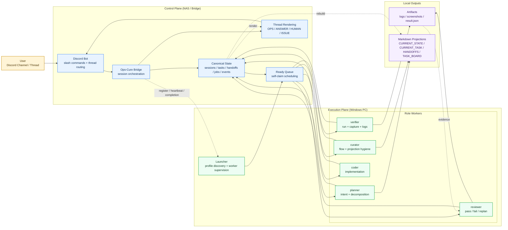

# Ops-Cure

Ops-Cure is a Discord-first orchestration framework for local AI CLI work.

It uses a two-plane architecture:

- `nas_bridge/` is the control plane that owns Discord, session state, tasks, handoffs, jobs, transcripts, and recovery.
- `pc_launcher/` is the execution plane that runs on a Windows machine with local AI CLIs, discovers project profiles, launches workers, and executes verification commands.

The current default runtime model is:

- `planner` for request interpretation and high-level task decomposition
- `curator` for queue hygiene, handoff flow, and projection cleanup
- `coder` for implementation
- `verifier` for build/run/capture/log evidence generation
- `reviewer` for evidence-based pass/fail/replan decisions

## At A Glance

Ops-Cure keeps orchestration state on the bridge, runs AI workers on a Windows machine, and uses Discord as the operator-facing control surface.

If you want the deeper version, see [docs/architecture.md](docs/architecture.md).

## Framework Diagram



This is the intended flow:

1. A user speaks in Discord.
2. The bridge translates that into canonical tasks, handoffs, jobs, and events.
3. Windows workers self-claim ready work that matches their role.
4. Local execution produces code, logs, screenshots, and review evidence.
5. The bridge renders concise thread updates while keeping the database as the source of truth.

## What Ops-Cure Is Trying To Solve

Ops-Cure is built for this workflow:

1. You talk to a Discord channel or thread.
2. The bridge turns that into canonical tasks and handoffs.
3. Windows workers self-claim ready work that matches their role.
4. The local machine produces code changes, logs, screenshots, and reports.
5. Discord remains the control surface, not the place where arbitrary shell commands run.

The framework is designed so that:

- Discord threads map to sessions.
- SQLite and task events are the source of truth.
- local markdown files are projections, not authoritative state.
- thread messages are an async collaboration bus, not the scheduler itself.

## Core Model

### Canonical State

Ops-Cure now treats the bridge database as the only source of truth for orchestration state.

Important concepts:

- `sessions`: top-level Discord-thread-backed work sessions
- `agents`: per-session agent registrations and worker heartbeats
- `tasks`: canonical units of work with state, scope, revision, and lease metadata
- `handoffs`: explicit queued, claimed, consumed, superseded, or failed transfers between roles
- `task_events`: append-style task history
- `jobs`: concrete units claimed by workers
- `verification_runs`: execution evidence runs and review outcomes

The key safety features are:

- `session_epoch` to reject stale worker updates after resets or recovery
- `task_revision` to reject outdated completions
- `lease_token` to prevent concurrent claim collisions
- `idempotency_key` to make duplicate completion/failure callbacks safe

### Self-Claim Scheduling

Ops-Cure is moving away from pure push-style handoff and toward canonical ready queues.

The bridge decides which tasks are ready based on:

- role match
- dependency readiness
- file scope
- semantic scope
- priority and retry policy

Idle agents claim matching work instead of waiting for every next step to be directly pushed by the planner.

### Thread Protocol

Discord thread messages are rendered views over structured internal events.

Visible line types:

- `OPS:` machine-friendly async collaboration updates
- `ANSWER:` direct answers to user questions
- `HUMAN:` short human-readable progress lines
- `ISSUE:` explicit blockers or escalation points

`discuss` messages are reserved for short, structured anomaly or ambiguity handling, for example:

- feature intent mismatch
- review interpretation mismatch
- runtime anomaly triage

## Repository Layout

```text
ops-cure/
  README.md
  nas_bridge/
    README.md
    Dockerfile
    docker-compose.yml
    requirements.txt
    app/
      api/
      capabilities/
      services/
      workflows/
      auth.py
      command_router.py
      config.py
      db.py
      discord_gateway.py
      drift_monitor.py
      main.py
      message_router.py
      models.py
      schemas.py
      session_service.py
      thread_manager.py
      transcript_service.py
      worker_registry.py
  pc_launcher/
    README.md
    requirements.txt
    artifact_workspace.py
    bridge_client.py
    cli_adapters.py
    cli_worker.py
    config_loader.py
    launcher.py
    process_io.py
    project_finder.py
    verification_runner.py
    worker_runtime.py
    scripts/
    projects/
      sample/
        project.yaml
        prompts/
          planner.md
          curator.md
          coder.md
          verifier.md
          reviewer.md
          finder.md
  tests/
```

## Current Execution Profile Model

Profiles live under `pc_launcher/projects/<profile-name>/project.yaml`.

The sample profile currently includes:

- one default top-level finder root: `C:\Users\darkh\Projects`
- five roles: `planner`, `curator`, `coder`, `verifier`, `reviewer`
- verification modes:
  - `smoke`
  - `play_capture`
  - `repro_bug`
- policy defaults such as:
  - `max_parallel_agents`
  - `auto_retry`
  - `quiet_discord`
  - `approval_mode`
  - `allow_cross_agent_handoff`

The long-term goal is for project-specific variation to live only in:

- `project.yaml`
- prompt files
- local scripts or wrapper commands

## Quick Start

### 1. Start the Bridge

See the bridge-specific guide:

- [C:\Users\darkh\Projects\ops-cure\nas_bridge\README.md](C:/Users/darkh/Projects/ops-cure/nas_bridge/README.md)

Typical local start:

```bash
cd nas_bridge
python -m pip install -r requirements.txt
uvicorn app.main:app --reload --host 0.0.0.0 --port 8080
```

Typical Docker start:

```bash
cd nas_bridge
docker compose up --build -d
```

### 2. Start the Launcher on Windows

See the launcher-specific guide:

- [C:\Users\darkh\Projects\ops-cure\pc_launcher\README.md](C:/Users/darkh/Projects/ops-cure/pc_launcher/README.md)

Typical local start:

```bash
cd pc_launcher
python -m pip install -r requirements.txt
python launcher.py daemon --projects-dir .\projects
```

If no launcher is registered, `/project start` will now tell you to start the PC launcher first instead of showing a misleading profile error.

### 3. Start a Session from Discord

Typical command:

```text
/project start target:MyProject
```

If the default `sample` profile is registered, `profile` can be omitted.

Other useful commands:

- `/project find query:<name>`
- `/project status`
- `/project pause`
- `/project resume`
- `/project close`
- `/project cleanup`
- `/policy show`
- `/policy set`
- `/verify run mode:smoke`
- `/verify latest`

## Verification Lane

The verifier role exists to keep execution evidence separate from implementation.

Expected outputs from a verification run include:

- `stdout.log`
- `stderr.log`
- `stdout.bin`
- `stderr.bin`
- `result.json`
- screenshots such as `desktop.png`

The intended flow is:

```text
planner -> coder -> verifier -> reviewer
```

This reduces the amount of runtime capture work done directly by the coder and gives the reviewer concrete evidence to inspect.

## Current Design Direction

The framework is currently converging on these rules:

- bridge database and task events are authoritative
- markdown files are rebuildable projections
- thread text is rendered from structured internal events
- self-claim is preferred over excessive push-style handoff
- `planner` owns interpretation
- `curator` owns flow hygiene and projection hygiene
- `reviewer` owns decision, not implementation
- `verifier` owns execution evidence

## Notes

- The current sample profile uses Claude locally because that CLI is confirmed working in this Windows environment.
- Verification commands in the sample profile are still generic placeholders until replaced with project-specific scripts.
- Existing session artifacts under project `_discord_sessions/` folders are useful for debugging, but they should never be treated as canonical scheduler state.

## Additional Documentation

- Architecture guide: [docs/architecture.md](docs/architecture.md)
- Bridge details: [C:\Users\darkh\Projects\ops-cure\nas_bridge\README.md](C:/Users/darkh/Projects/ops-cure/nas_bridge/README.md)
- Launcher details: [C:\Users\darkh\Projects\ops-cure\pc_launcher\README.md](C:/Users/darkh/Projects/ops-cure/pc_launcher/README.md)
