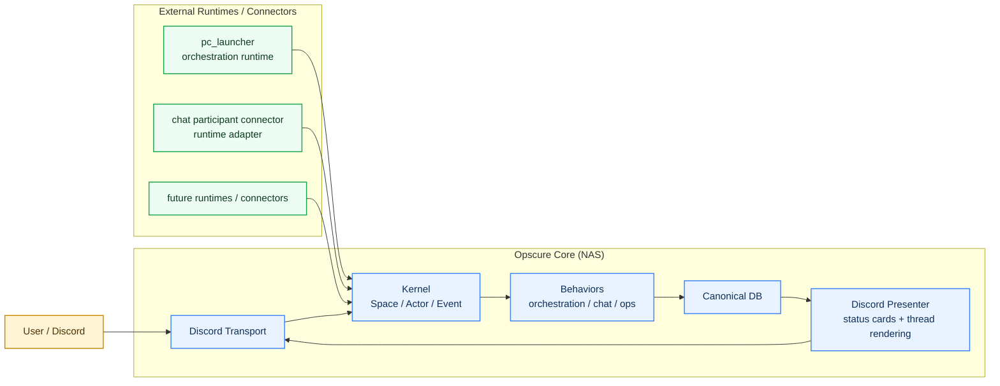

# Opscure

Opscure is a channel-native state/event kernel.

It treats a Discord channel or thread as a stateful space, then lets different behaviors run on top of that shared kernel. `orchestration` is one behavior. `chat` and `ops` are others. The kernel is the product; the behaviors are plugins.

## At A Glance

- `nas_bridge/` is the deployed core.
- The core owns generic `Space / Actor / Event` state, behavior registration, Discord transport, and rendered status output.
- Behaviors such as `orchestration`, `chat`, and `ops` plug into that core.
- PC-side code is runtime-specific.
- The current `pc_launcher/` is an `orchestration` runtime, not a universal runtime for every behavior.

If you want the deeper structure, see [docs/architecture.md](docs/architecture.md).
If you want the ongoing kernel split notes, see [docs/generic-kernel.md](docs/generic-kernel.md).
If you want the generic kernel vs product/service boundary for browser-first remote Codex, see [docs/generic-kernel-product-boundary.md](docs/generic-kernel-product-boundary.md).
If you want only the later kernel-promotion candidates, see [docs/generic-kernel-promotion-candidates.md](docs/generic-kernel-promotion-candidates.md).
If you want operating guardrails, see [docs/checklists.md](docs/checklists.md).
If you want the browser-first remote Codex product design, see [docs/browser-first-remote-codex.md](docs/browser-first-remote-codex.md).
If you want the execution backlog for that design, see [docs/browser-first-remote-codex-execution-plan.md](docs/browser-first-remote-codex-execution-plan.md).
If you want the live migration checklist for moving a Discord room onto remote-task execution, see [docs/remote-task-cutover-checklist.md](docs/remote-task-cutover-checklist.md).
If you want the planned landing zone for the `remote_codex` behavior itself, see [nas_bridge/app/behaviors/remote_codex/README.md](nas_bridge/app/behaviors/remote_codex/README.md).
That package now contains a thin behavior scaffold over the current remote task service, without changing live wiring yet.

## What Opscure Is

Opscure is best described as:

- a **channel-based state/event kernel**
- with **behavior plugins**
- plus **transport adapters**
- plus **runtime adapters**

That means:

- the kernel does not assume tasks, handoffs, planners, or reviews
- `orchestration` is a behavior that adds those ideas
- `chat` is a behavior for conversational rooms
- `ops` is a behavior for lightweight incident rooms

## System Model



## Current Public Behaviors

### `orchestration`

This is the original Discord-based AI work orchestration framework.

It adds:

- `planner`, `curator`, `coder`, `verifier`, `reviewer`
- canonical tasks, handoffs, jobs, verification runs
- self-claim scheduling
- markdown workflow projections
- `/project ...` command surface

Today, `pc_launcher/` exists primarily for this behavior.

### `chat`

This is a dialogue-room behavior.

It adds:

- chat rooms backed by Discord threads
- participants and chat messages
- generic room state for Codex-to-Codex or human-to-AI chat
- chat-specific participant registration, heartbeat, delta fetch, and message submit APIs

This behavior is intentionally separate from `orchestration`. It does not require tasks or handoffs.

### `ops`

This is a lightweight incident-room behavior.

It adds:

- issue / resolve / status events
- a small ops room state model
- room-style coordination without workflow semantics

## Core Vocabulary

The generic kernel is converging on these shared concepts:

- `Space`
  - a stateful room, thread, or session
- `Actor`
  - a human, AI, bot, or system participant
- `Event`
  - a recorded fact inside a space
- `Behavior`
  - domain logic that interprets events and maintains domain state

The important rule is:

- the kernel stays generic
- domain-specific semantics live inside behaviors
- machine-specific execution details live inside runtimes or connectors

## Repository Layout

```text
ops-cure/
  README.md
  docs/
    architecture.md
    generic-kernel.md
    checklists.md
  nas_bridge/
    app/
      api/
      behaviors/
        orchestration/
        workflow/
        chat/
        ops/
        game/
      kernel/
      presenters/
        discord/
      transports/
        discord/
      capabilities/
      services/
      workflows/
      main.py
      db.py
      discord_gateway.py
      thread_manager.py
  pc_launcher/
    connectors/
      chat_participant/
    runtimes/
      local_windows/
    domains/
      workflow_default/
    launcher.py
    bridge_client.py
    worker_runtime.py
  tests/
```

## Deployment Model

The intended deployment split is:

- **NAS**
  - generic core
  - behavior plugins
  - Discord transport
  - DB and status rendering
- **PCs**
  - behavior-specific runtimes or connectors

Today that means:

- `nas_bridge/` is the deployable core
- `pc_launcher/` is the Windows runtime for `orchestration`
- `chat participant connector` is a separate adapter, not part of the generic kernel

## Current Runtime Reality

The codebase is generic at the core layer, but the existing production runtime is still strongest in `orchestration`.

That distinction matters:

- the **core** is generic
- the **current launcher** is not

So right now:

- `orchestration` is production-oriented
- `chat` and `ops` validate the kernel shape
- additional runtimes/connectors can be added without changing the kernel vocabulary

## Installable Behaviors

Opscure now treats runtime-side behaviors as installable packages, not just loose code paths.

Current packaged examples are:

- `chat-participant`
- `remote-executor`

That package includes:

- a behavior manifest under `pc_launcher/behaviors/chat_participant/behavior.yaml`
- an installer that scaffolds a client project file and `.env`
- a doctor command that checks bridge reachability and local Codex availability
- a run command that starts the chat participant runner
- a send command for UTF-8-safe manual message submission

Typical commands:

```bash
python -m pc_launcher.behavior_tools install chat-participant
python -m pc_launcher.behavior_tools doctor chat-participant
python -m pc_launcher.behavior_tools run chat-participant --thread-id <thread_id> --actor-name <actor_name> --codex-thread-id <codex_thread_id>
python -m pc_launcher.behavior_tools send chat-participant --thread-id <thread_id> --actor-name <actor_name> --message-file C:\path\to\message.txt
python -m pc_launcher.behavior_tools install remote-executor
python -m pc_launcher.behavior_tools doctor remote-executor
python -m pc_launcher.behavior_tools run remote-executor --machine-id <machine_id> --actor-id <actor_id> --codex-thread-id <codex_thread_id>
```

On Windows, PowerShell wrappers live under `pc_launcher/scripts/`.

## Generic Kernel Rules

These are the design rules the repo is now following:

- generic kernel types should not grow behavior-specific fields casually
- read paths should prefer existing generic APIs first
- behavior-specific policies should stay in the behavior layer
- local machine execution details should stay in runtime/connector layers
- Discord is a transport, not the kernel itself

For example:

- participant unread state belongs to `chat`
- local Codex invocation belongs to a connector/runtime adapter
- task/handoff semantics belong to `orchestration`

## APIs

Current generic read APIs:

- `/api/spaces`
- `/api/actors`
- `/api/events`
- `/api/behaviors`

Behavior-specific APIs exist where the kernel should stay generic.

Example:

- `chat` uses dedicated participant and delta endpoints instead of forcing unread state into generic kernel models

## Quick Start

### 1. Start the NAS core

See:

- [C:\Users\darkh\Projects\ops-cure\nas_bridge\README.md](C:/Users/darkh/Projects/ops-cure/nas_bridge/README.md)

Typical local run:

```bash
cd nas_bridge
python -m pip install -r requirements.txt
uvicorn app.main:app --reload --host 0.0.0.0 --port 8080
```

Typical Docker run:

```bash
cd nas_bridge
docker compose up --build -d
```

### 2. Start the orchestration runtime

See:

- [C:\Users\darkh\Projects\ops-cure\pc_launcher\README.md](C:/Users/darkh/Projects/ops-cure/pc_launcher/README.md)

Typical local run:

```bash
cd pc_launcher
python -m pip install -r requirements.txt
python launcher.py daemon --projects-dir .\projects
```

### 3. Use the current orchestration behavior

Typical command:

```text
/project start target:MyProject
```

Other orchestration commands:

- `/project find query:<name>`
- `/project status`
- `/project pause`
- `/project resume`
- `/project close`
- `/project cleanup`
- `/policy show`
- `/policy set`
- `/verify run mode:smoke`
- `/verify latest`

### 4. Use the non-workflow behaviors

Behavior-specific commands exist alongside orchestration.

Examples:

- `/chat start`
- `/chat state`
- `/ops start`
- `/ops state`

## Notes

- The current sample workflow runtime uses Claude locally because that CLI is confirmed working in this Windows environment.
- `pc_launcher` should be thought of as an orchestration runtime package, not a universal runtime for every behavior.
- Existing `_discord_sessions/` markdown files are still useful for debugging orchestration runs, but they are not generic kernel truth.

## Additional Documentation

- Architecture guide: [docs/architecture.md](docs/architecture.md)
- Generic kernel notes: [docs/generic-kernel.md](docs/generic-kernel.md)
- Guardrails and checklists: [docs/checklists.md](docs/checklists.md)
- Bridge details: [C:\Users\darkh\Projects\ops-cure\nas_bridge\README.md](C:/Users/darkh/Projects/ops-cure/nas_bridge/README.md)
- Launcher details: [C:\Users\darkh\Projects\ops-cure\pc_launcher\README.md](C:/Users/darkh/Projects/ops-cure/pc_launcher/README.md)
