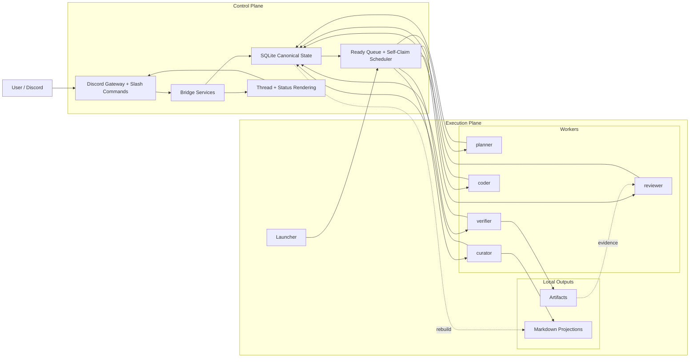
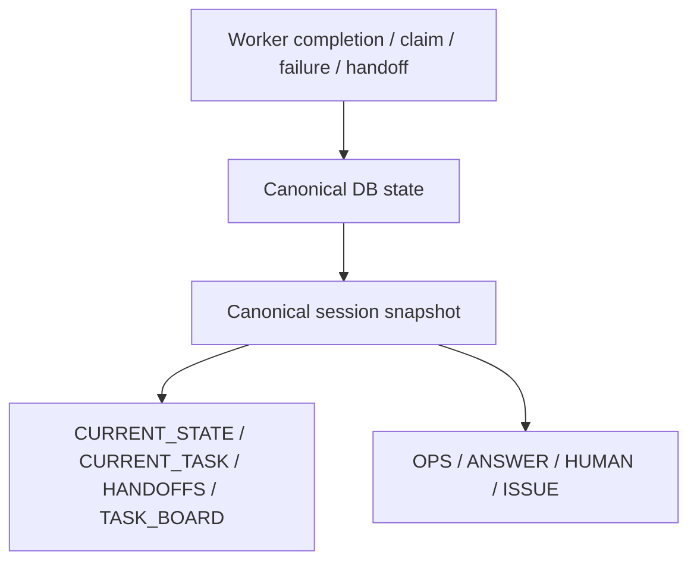

# Opscure Architecture

This document explains how Opscure is structured today and how the main runtime flow is supposed to work.

For practical operating guardrails, see [checklists.md](checklists.md).
For the ongoing generic kernel split, see [generic-kernel.md](generic-kernel.md).

## Overview

Opscure is a two-plane system:

- The **control plane** lives in `nas_bridge/`.
- The **execution plane** lives in `pc_launcher/`.

The bridge owns canonical state, Discord integration, routing, task scheduling, recovery, and rendering.
The launcher owns local process supervision, worker execution, local CLI integration, verification commands, and artifact generation.

## System Diagram



## Responsibility Split

### Bridge

The bridge is responsible for:

- Discord slash commands and thread lifecycle
- canonical sessions, agents, jobs, tasks, handoffs, and task events
- scheduling ready work
- worker registration and heartbeat tracking
- recovery, drift handling, and status rendering

The bridge does **not** directly run Claude, Codex, or other local AI CLIs.

### Launcher

The launcher is responsible for:

- discovering registered execution profiles
- registering those profiles with the bridge
- supervising one local worker process per agent
- connecting local CLIs to bridge jobs
- running verification commands
- writing local artifacts and projections

## Canonical State Model

Opscure is moving toward a strict rule:

- the database is the source of truth
- markdown files are rebuildable projections
- Discord thread text is rendered output, not scheduling state

Important entities:

- `sessions`
- `agents`
- `jobs`
- `tasks`
- `handoffs`
- `task_events`
- `verification_runs`

Safety metadata:

- `session_epoch`
- `task_revision`
- `lease_token`
- `idempotency_key`

These fields exist so that stale workers, duplicate callbacks, and late completions do not overwrite current state.

## Runtime Roles

### planner

- interprets user intent
- decomposes large requests into tasks
- resolves ambiguity when higher-level direction is needed

### curator

- keeps handoff flow clean
- rebuilds and stabilizes markdown projections
- coordinates short `discuss` loops when anomaly or interpretation drift appears

### coder

- performs implementation work
- writes code and task-local change summaries

### verifier

- runs build, smoke, repro, or capture commands
- produces logs, screenshots, and machine-readable evidence

### reviewer

- inspects implementation and verification evidence
- returns pass, fail, or replan-style decisions

## Scheduling Model

Opscure is converging on **ready queue + self-claim** scheduling.

That means:

- the bridge determines which tasks are ready
- idle agents claim matching work
- work is not supposed to depend entirely on one role manually pushing every next step

The scheduler can consider:

- role match
- dependency readiness
- file scope
- semantic scope
- retry state
- priority and aging

## Verification Lane

Verification is intentionally separated from implementation.

Target flow:

```text
planner -> coder -> verifier -> reviewer
```

Verifier outputs are expected to include things like:

- `stdout.log`
- `stderr.log`
- `stdout.bin`
- `stderr.bin`
- `result.json`
- screenshots such as `desktop.png`

This keeps runtime evidence generation out of the coder role and gives the reviewer concrete artifacts to inspect.

## Thread Protocol

Discord thread updates are intended to be concise rendered events.

Visible prefixes:

- `OPS:` machine-friendly collaboration update
- `ANSWER:` direct answer to the user
- `HUMAN:` short human-readable progress summary
- `ISSUE:` explicit blocker or escalation

`discuss` is reserved for short, structured ambiguity handling, not free-form chatter.

Expected lifecycle:

```text
discuss_open -> discuss_reply -> discuss_resolve
```

or

```text
discuss_open -> discuss_reply -> discuss_escalate
```

## Live Activity Rendering

Opscure also maintains a lightweight live-activity layer for active workers.

The execution plane reads the latest stdout or stderr line from each running CLI process and includes only the latest sanitized line in worker heartbeats.

The bridge stores that latest line on the agent record and renders it into the session status card.

Important rules:

- only `busy` workers are shown
- only the latest activity line is shown
- the thread does not accumulate line-by-line worker logs
- worker activity is informational and does not become scheduling truth

## State And Projection Flow



This is the intended rule:

- state changes update canonical DB rows
- snapshots are built from canonical rows
- markdown and thread output are both rendered from the same snapshot

## Current Direction

The current design direction is:

- keep project-specific differences inside profile YAML, prompts, and scripts
- keep orchestration generic
- let Discord remain the operator surface
- keep execution local and explicit
- avoid using local markdown files as scheduling truth

## Related Docs

- Root overview: [../README.md](../README.md)
- Bridge details: [../nas_bridge/README.md](../nas_bridge/README.md)
- Launcher details: [../pc_launcher/README.md](../pc_launcher/README.md)
