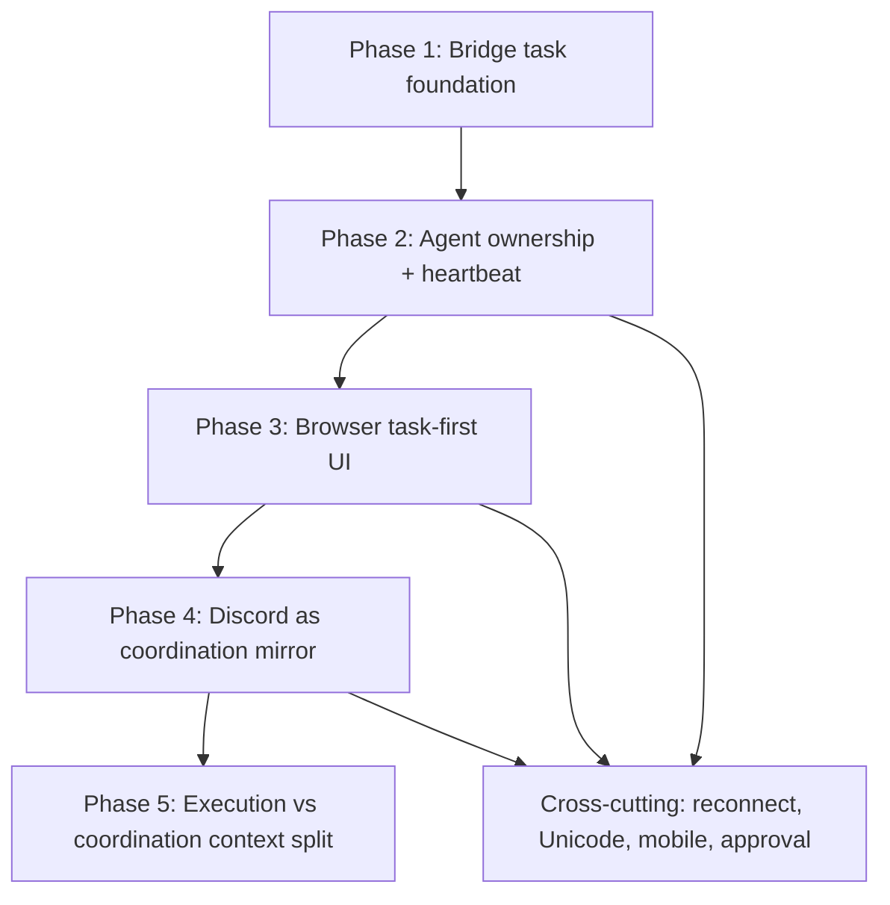

# Browser-First Remote Codex Execution Plan

This document turns the browser-first remote Codex design into an implementation backlog.

The companion design document is:

- [browser-first-remote-codex.md](browser-first-remote-codex.md)
- [generic-kernel-product-boundary.md](generic-kernel-product-boundary.md)

This plan is intentionally product-first.
The priority is not "finish the architecture".
The priority is "make the browser feel like local Codex use".

## Product Success Definition

The work in this plan is only successful if a user can:

- choose a machine in the browser
- open a thread and trust what they see
- send a turn and get immediate feedback
- follow progress without ambiguity
- recover safely after reconnect
- handle approval and interruption clearly
- switch machines without state bleeding
- trust Unicode, markdown, image, and long-output rendering
- use the site on mobile without degraded control

Discord support is secondary.
Browser and bridge truth are primary.

## Non-Negotiable Rules

1. Browser state must come from bridge truth, not Discord text.
2. Execution claims must be backed by structured evidence.
3. One active task should have one owner unless parallel review is explicit.
4. The browser should never look blank after a successful submit.
5. Progress, approval, interruption, and reconnect must be typed states, not guesses.

## Implementation Strategy

The migration should happen in five tracks that move in parallel but land in a strict order:

1. Bridge task and evidence foundation
2. Agent task ownership and heartbeat
3. Browser task-first rendering
4. Discord demotion from executor to coordination mirror
5. Context split between execution and coordination

The order matters because the browser cannot become reliable until the bridge can represent reliable work state.

## Workstream Summary

## Phase 1: Bridge Task Foundation

### Goal

Introduce a canonical task object for remote Codex work so browser actions stop depending on free-form room messages.

### Scope

Bridge/NAS only.
No Discord protocol rewrite yet.
No browser redesign yet.

### Required Data Model

Add canonical models for:

- `remote_tasks`
- `remote_task_assignments`
- `remote_task_heartbeats`
- `remote_task_evidence`
- `remote_task_approvals`
- `remote_task_notes`

Suggested minimum fields:

#### `remote_tasks`

- `id`
- `machine_id`
- `thread_id`
- `origin_surface`
- `origin_message_id`
- `objective`
- `success_criteria_json`
- `status`
- `priority`
- `owner_actor_id`
- `created_at`
- `updated_at`

#### `remote_task_assignments`

- `id`
- `task_id`
- `actor_id`
- `lease_token`
- `lease_expires_at`
- `status`
- `claimed_at`
- `released_at`

#### `remote_task_heartbeats`

- `id`
- `task_id`
- `actor_id`
- `phase`
- `summary`
- `commands_run_count`
- `files_read_count`
- `files_modified_count`
- `tests_run_count`
- `updated_at`

#### `remote_task_evidence`

- `id`
- `task_id`
- `actor_id`
- `kind`
- `summary`
- `payload_json`
- `created_at`

#### `remote_task_approvals`

- `id`
- `task_id`
- `machine_id`
- `thread_id`
- `reason`
- `status`
- `requested_at`
- `resolved_at`
- `resolution`

#### `remote_task_notes`

- `id`
- `task_id`
- `actor_id`
- `kind`
- `content`
- `created_at`

### Required Bridge APIs

Add:

- `POST /api/remote/tasks`
- `GET /api/remote/tasks/{task_id}`
- `GET /api/remote/machines/{machine_id}/tasks`
- `POST /api/remote/tasks/{task_id}/claim`
- `POST /api/remote/tasks/{task_id}/heartbeat`
- `POST /api/remote/tasks/{task_id}/evidence`
- `POST /api/remote/tasks/{task_id}/complete`
- `POST /api/remote/tasks/{task_id}/fail`
- `POST /api/remote/tasks/{task_id}/interrupt`
- `POST /api/remote/tasks/{task_id}/handoff`
- `GET /api/remote/tasks/{task_id}/approval`
- `POST /api/remote/tasks/{task_id}/approval/approve`
- `POST /api/remote/tasks/{task_id}/approval/deny`
- `GET /api/remote/tasks/{task_id}/notes`
- `POST /api/remote/tasks/{task_id}/notes`

### Required Event Stream Additions

Add bridge stream events for:

- `task.created`
- `task.claimed`
- `task.heartbeat`
- `task.evidence.added`
- `task.blocked_approval`
- `task.completed`
- `task.failed`
- `task.interrupted`
- `task.stalled`

### Acceptance Criteria

- Browser-originated work can be represented as a task without Discord.
- One task can be listed with current owner and status.
- A task can be resumed after reconnect by querying bridge state.
- Approval state can be tied to a task instead of plain transcript text.

## Phase 2: Agent Ownership and Heartbeat

### Goal

Make device-side Codex agents work against canonical tasks instead of reacting to room messages.

### Scope

PC connector changes, bridge integration, evidence emission.

### Required Agent Contract

Each agent must:

1. subscribe to machine-specific remote tasks
2. claim one task with a lease
3. emit `claimed`
4. emit `executing` only after actual work starts
5. push heartbeat updates while working
6. push structured evidence during work
7. complete or fail the task explicitly

### Required Agent Evidence Types

At minimum:

- `command_execution`
- `file_read`
- `file_write`
- `test_result`
- `runtime_turn_started`
- `runtime_turn_completed`
- `approval_requested`
- `error`

### Required Guardrails

The agent must not emit "working" if:

- it has not started a runtime turn
- it has not read files
- it has not run a command
- it has not produced any other work signal

The bridge should reject or normalize misleading heartbeats.

### Required Runtime Changes

The current chat participant runtime should split into:

- `task_executor_runtime`
- `coordination_note_runtime`

The executor runtime should attach to canonical execution threads.
The coordination runtime should only summarize or ask questions.

### Acceptance Criteria

- One agent can claim a task and keep it alive with heartbeats.
- Bridge can detect stale ownership if heartbeats stop.
- Task progress can be inferred from typed heartbeats and evidence alone.
- "I am working" text is no longer needed to know whether work really started.

## Phase 3: Browser Task-First Rendering

### Goal

Make the browser represent remote Codex work through tasks plus transcript state rather than through transcript alone.

### Scope

Front-end state model, queue rendering, approval rendering, reconnect rendering.

### Required Browser UI Components

#### Machine Header

Show:

- machine status
- live or read-only state
- reconnecting state
- last synced time

#### Thread View

Show:

- canonical transcript
- optimistic local turn bubble on submit
- remote acceptance state
- replay/reconnect state
- empty-state guidance if sync is delayed

#### Task Panel

Show:

- queued tasks
- claimed task
- current owner
- phase
- approval block
- interrupt state
- evidence summary

#### Status Chips

Minimum chips:

- `Queued`
- `Claimed`
- `Executing`
- `Blocked`
- `Approval`
- `Interrupting`
- `Reconnecting`
- `Synced`
- `Stalled`

### Required Front-End State Model

Separate these concerns:

- transcript freshness
- task state
- approval state
- queue state
- reconnect state
- optimistic local submission state

Do not collapse them into one generic "working" label.

### Required Submit Flow

When the user submits:

1. create optimistic local task row
2. create optimistic local user bubble
3. POST remote task
4. transition task to real bridge id
5. attach to transcript stream
6. recover missed messages via cursor if stream reconnects

### Acceptance Criteria

- Browser never looks blank after successful turn submit.
- User can tell whether the runtime accepted the work.
- User can tell whether transcript is stale or merely reconnecting.
- Task ownership and approval state are visible without reading Discord.

## Phase 4: Discord Demotion and Coordination Model

### Goal

Keep Discord useful for collaboration while removing its authority over canonical execution.

### Scope

Discord commands, message handling, projection rules.

### New Discord Role

Discord should become:

- a mirror of task progress and task results
- a place for explicit questions and handoffs
- a place for cross-check notes

Discord should stop being:

- the default execution trigger
- the source of "working or not"
- the source of transcript truth

### Allowed Discord Input

Allowed:

- explicit task creation
- explicit handoff
- explicit coordination question
- explicit note on an existing task

Disallowed:

- AI progress text turning into new work
- AI final-result text becoming execution input
- AI-to-AI chatter causing implicit task creation

### Required Discord Types

Replace ad hoc tags with bridge-backed note kinds:

- `coordination.question`
- `coordination.handoff`
- `coordination.note`
- `task.progress_mirror`
- `task.result_mirror`
- `task.approval_needed`

### Acceptance Criteria

- Discord can no longer create AI meta-loops that the bridge mistakes for work.
- A human can still coordinate and cross-check from Discord.
- Discord mirrors task progress but does not define task truth.

## Phase 5: Execution and Coordination Context Split

### Goal

Stop overloading one shared Codex thread id as both the local execution thread and the room discussion context.

### Scope

Agent runtime and bridge bindings.

### Required Context Objects

Each task may reference:

- `execution_thread_id`
- `coordination_space_id`
- `coordination_note_context`

### Rules

- Browser execution uses the execution thread.
- Discord coordination uses notes and optional coordination prompts.
- Coordination prompts must not replace the canonical execution prompt.
- Execution transcript is canonical for browser rendering.

### Acceptance Criteria

- Same machine can have stable execution context even while Discord notes continue.
- Room coordination no longer changes execution persona unpredictably.
- "Same thread id, different behavior" stops being a routine failure mode.

## Cross-Cutting Product Fixes

These should be implemented alongside the phases above.

### Reconnect and Backfill

- preserve transcript cursor per machine and thread
- backfill safely after SSE interruption
- expose `reset required` if replay window is no longer trusted

### Approval UX

- approval requests must be typed state
- browser must show pending approvals without relying on transcript parsing
- approval resolution must feed back into task state and transcript state

### Unicode and Rendering

- standardize UTF-8 process boundaries
- treat Korean and mixed markdown as first-class
- ensure mirrored content preserves Unicode

### Mobile Usability

- sticky composer
- usable machine switcher
- readable status area
- no hidden approval or queue state behind desktop-only panels

## Execution Backlog

This is the recommended landing order.

### Sprint 1: Bridge Schema and Task APIs

- add remote task tables
- add remote task service
- add task CRUD and claim endpoints
- add task event emission
- add task approval records

Done when:

- a browser action can create a task
- the task can be claimed
- the bridge can stream task events

### Sprint 2: Agent Claim and Evidence

- add task claim loop to PC connector
- add heartbeat endpoint integration
- add structured evidence emission
- reject "working" without evidence

Done when:

- a task can move from `queued` to `executing`
- browser and bridge can tell that real work started

### Sprint 3: Browser Queue and Status Panel

- render task list per machine/thread
- add optimistic submit state
- render claimed/executing/blocked/interrupted states
- show owner and freshness

Done when:

- user can watch task progress without Discord

### Sprint 4: Transcript Honesty and Reconnect

- separate transcript freshness from task phase
- improve reconnect/backfill labeling
- ensure empty-looking transcript is never ambiguous

Done when:

- browser clearly distinguishes `no transcript yet`, `reconnecting`, and `runtime accepted but not yet emitted`

### Sprint 5: Discord Mirror Conversion

- convert Discord messages to task mirrors and notes
- stop implicit execution from AI messages
- add explicit task create/handoff flow

Done when:

- Discord remains useful but cannot distort task truth

### Sprint 6: Context Split

- introduce execution thread bindings
- reduce or remove thick room prompt injection for execution
- keep coordination notes separate

Done when:

- remote execution feels more like local Codex usage

## Suggested File Ownership

This is not mandatory, but it helps parallelize work.

### Bridge/NAS

Likely areas:

- `nas_bridge/app/api/`
- `nas_bridge/app/services/`
- `nas_bridge/app/kernel/`
- `nas_bridge/app/behaviors/chat/`

### Browser Product

Likely areas:

- current bridge browser app repo
- transcript state modules
- queue/status rendering modules
- reconnect/backfill logic

### PC Connector

Likely areas:

- `pc_launcher/connectors/chat_participant/`
- task executor runtime
- evidence emission
- current-thread runtime integration

## QA Plan

The system should only be considered complete if these scenarios pass from the browser:

1. submit turn on machine A and see immediate local feedback
2. watch task move from queued to executing with owner shown
3. disconnect and reconnect SSE, then confirm transcript backfill
4. trigger approval-required action and confirm approval UI
5. interrupt a running task and confirm honest state transition
6. switch to machine B and confirm no state bleed
7. submit Korean input and confirm output integrity
8. render markdown and long output correctly
9. use the flow on mobile without hidden critical controls

## Metrics

Track these metrics in bridge telemetry:

- time from browser submit to optimistic render
- time from browser submit to task claim
- time from task claim to first evidence
- time from task claim to first transcript delta
- reconnect recovery time
- stalled task count
- approval wait duration
- interrupt completion duration

## Kill Criteria for the Old Model

The legacy chat-driven execution model can be retired when:

- browser-created work no longer relies on Discord routing
- agent work is task-claimed, not message-reactive
- execution evidence is structured
- Discord progress is mirrored from task state
- browser has complete queue/approval/progress trust on its own

## Final Priority Statement

If tradeoffs are needed, prioritize in this order:

1. browser trust
2. task ownership clarity
3. evidence-backed execution
4. reconnect safety
5. approval and interrupt honesty
6. Discord convenience

The product wins only when the browser feels like local Codex use, not when the room chat feels clever.
