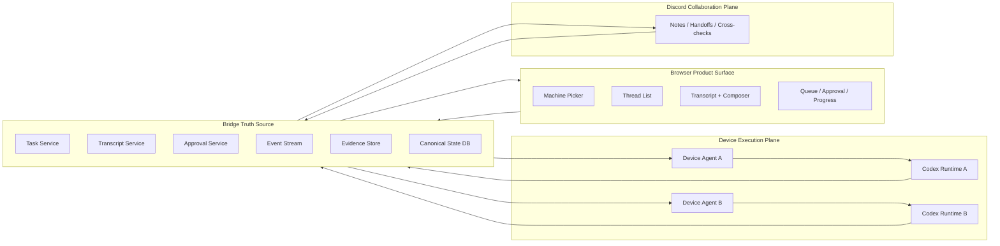

# Browser-First Remote Codex Design

This document describes the product and system design needed to make remote Codex usage feel like using a local Codex session directly from the browser.

For the implementation backlog and landing order, see [browser-first-remote-codex-execution-plan.md](browser-first-remote-codex-execution-plan.md).
For the kernel vs product split and schema boundary, see [generic-kernel-product-boundary.md](generic-kernel-product-boundary.md).

The target surface is:

- [semirainnas.tailb6e1a3.ts.net](https://semirainnas.tailb6e1a3.ts.net/)

The goal is not just to add more bridge features. The goal is to make the browser experience reliable enough that a user can switch devices, inspect threads, send instructions, follow progress, handle approval, recover from disconnects, and keep trust in what the UI says.

## Why This Document Exists

Today, the system can already do several useful things:

- expose generic `Space / Actor / Event` state from the NAS core
- attach PC-side Codex participants to a shared room
- let Codex participants talk in Discord
- let a browser drive remote device state through the bridge

But the current collaboration path still behaves too much like a chat system:

- Discord messages are often treated as work input
- AI meta-messages can become the next AI input
- progress reporting is message-triggered instead of state-driven
- the same Codex thread id can still behave differently because each room participant injects a thick turn-local prompt
- users cannot always tell whether real work started or whether they are looking at planning text

That mismatch matters because the desired product is not "AI agents chatting". It is "browser-first remote Codex that feels local".

## Product Goal

The product must let a user:

- choose a device in the browser
- inspect that device's Codex threads
- send a new instruction
- see queued, in-progress, blocked, approval-required, interrupted, reconnecting, and synced states clearly
- see transcript updates quickly and honestly
- switch to another device without mixing state
- trust Korean, Unicode, markdown, images, and long output
- use the site on mobile without losing control

The browser is the product surface.
The bridge API is the truth source for state and events.
Device-side Codex runtimes are the execution plane.
Discord is a collaboration plane only.

## Design Principles

### 1. Browser Truth Wins

If Discord says one thing and the browser says another, the browser and bridge win.

### 2. Tasks, Not Chat Messages

User instructions must become canonical tasks, not free-form room chatter.

### 3. Evidence Before Claims

No actor should be allowed to imply "work has started" unless the bridge has real execution evidence.

### 4. Ownership Before Output

One active task should have one explicit owner at a time.

### 5. Structured State Before Textual Heuristics

If a state matters to product trust, it must exist as typed bridge state, not only as text inside a chat message.

### 6. Discord Is Secondary

Discord can mirror, coordinate, and cross-check, but it must not become the canonical scheduler or transcript source.

## Current Failure Modes

The current chat-participant model produces these product failures:

- AI planning loops and agreement churn
- misleading progress chatter with no real work evidence
- one actor silently claiming a human message while another actor stays quiet
- different behavior despite sharing the same Codex thread id
- intermediate progress not being emitted unless a human message triggered the turn
- no stable distinction between a directive, a progress update, a handoff, and a final result
- no canonical way to know whether an actor is really editing or just replying

These are not just "room quality" issues. They directly hurt the browser product because they contaminate coordination, status, and trust.

## Proposed Model

The system should move from a message-driven room model to a task/state/evidence model.

### High-Level Planes



### Primary Objects

#### Machine

A machine is a reachable execution target.

Suggested fields:

- `machine_id`
- `display_name`
- `platform`
- `runtime_mode`
- `status`
- `last_seen_at`
- `capabilities`

#### Canonical Thread

A canonical thread is the browser-visible remote Codex thread for one machine.

Suggested fields:

- `thread_id`
- `machine_id`
- `title`
- `origin`
- `runtime_binding`
- `last_turn_at`
- `transcript_cursor`
- `sync_state`

#### Task

A task is the canonical execution unit created from browser input or explicit Discord task creation.

Suggested fields:

- `task_id`
- `machine_id`
- `thread_id`
- `origin_surface`
- `origin_message_id`
- `objective`
- `success_criteria`
- `status`
- `priority`
- `owner_actor_id`
- `created_at`
- `updated_at`

#### Task Assignment

A task assignment binds one task to one worker/actor with a lease.

Suggested fields:

- `assignment_id`
- `task_id`
- `actor_id`
- `lease_token`
- `lease_expires_at`
- `status`
- `claimed_at`
- `released_at`

#### Task Heartbeat

A task heartbeat is a typed progress signal emitted by the owner.

Suggested fields:

- `task_id`
- `actor_id`
- `phase`
- `summary`
- `files_read_count`
- `files_modified_count`
- `commands_run_count`
- `tests_run_count`
- `updated_at`

#### Evidence

Evidence is structured execution output, not a room sentence.

Suggested fields:

- `evidence_id`
- `task_id`
- `actor_id`
- `kind`
- `summary`
- `payload`
- `created_at`

Kinds may include:

- `command_execution`
- `file_read`
- `file_write`
- `test_result`
- `screenshot`
- `approval_request`
- `error`

#### Approval Gate

Approval state must be owned by the bridge and exposed as typed task state.

Suggested fields:

- `approval_id`
- `task_id`
- `thread_id`
- `machine_id`
- `reason`
- `requested_at`
- `resolved_at`
- `resolution`

#### Coordination Note

A coordination note is a Discord-visible discussion item that never becomes canonical execution state by itself.

Suggested fields:

- `note_id`
- `task_id`
- `actor_id`
- `kind`
- `content`
- `created_at`

Kinds may include:

- `question`
- `handoff`
- `crosscheck`
- `human_note`

## State Machine

Tasks should use a typed lifecycle:

```text
draft
queued
claimed
executing
blocked_approval
verifying
completed
failed
interrupted
stalled
```

Rules:

- Only `queued` tasks may be claimed.
- Only one live assignment may exist for one task unless the task explicitly enters a parallel review mode.
- `executing` requires evidence-bearing heartbeat updates.
- `blocked_approval` requires an open approval record.
- `stalled` means the lease is still present or recently expired, but the bridge did not receive valid heartbeat/evidence on time.
- `completed` requires a final result and evidence.

## Surface Responsibilities

### Browser

The browser must:

- create tasks from user instructions
- render typed state from the bridge
- show optimistic local feedback for newly created tasks
- recover transcript gaps after reconnect
- preserve machine separation and thread separation
- render approvals, queue position, interruptions, and reconnecting honestly

The browser must not infer execution state from Discord or free-form notes.

### Bridge

The bridge must own:

- canonical task creation
- task leasing and ownership
- transcript sync cursors
- approval state
- evidence records
- typed event stream for browser recovery
- progress freshness and stalled detection

### Device Agent

The device agent must:

- claim tasks
- bind them to a local runtime
- emit typed heartbeat updates
- emit structured evidence
- write final result state
- request approval through the bridge, not by ad hoc room sentences

The agent must not claim "working" unless it has produced evidence or at least one meaningful heartbeat transition.

### Discord

Discord should only do three things:

- mirror progress/result state for humans
- allow explicit coordination and handoff
- support cross-check discussion

Discord should not be the canonical path for free-form execution triggering.

## Input Model

### Browser-Originated Work

Browser work must create tasks directly.

Flow:

1. user picks machine and thread
2. browser posts `task/create`
3. bridge records task and emits optimistic queue event
4. agent claims task
5. browser shows `queued -> claimed -> executing`

### Discord-Originated Work

Discord should only create tasks through explicit task syntax or command handling.

Valid examples:

- `/task create ...`
- `[TASK]` with a recognized parser and a human sender
- a UI action that mirrors into Discord after the task already exists

Invalid model:

- any plain AI message becoming execution input
- free-form progress chatter starting new work

## Context Model

The current shared-thread approach is not enough because each room participant injects a heavy turn-local prompt.

Instead, split context into three layers:

### 1. Canonical Execution Thread

This is the real Codex thread tied to browser work on a machine.

Properties:

- owned by the machine runtime
- used for actual browser-triggered work
- source for remote transcript

### 2. Coordination Thread

This is a Discord-side or task-note discussion context.

Properties:

- used for planning, questions, and cross-checks
- never treated as canonical execution transcript

### 3. Task Attachment

A task may point at both:

- `execution_thread_id`
- `coordination_thread_id`

This removes the need to pretend one room prompt is the same thing as the user's real Codex surface.

## Bridge API Design

### Task APIs

Suggested endpoints:

- `POST /api/tasks`
- `GET /api/tasks/{task_id}`
- `POST /api/tasks/{task_id}/claim`
- `POST /api/tasks/{task_id}/heartbeat`
- `POST /api/tasks/{task_id}/complete`
- `POST /api/tasks/{task_id}/fail`
- `POST /api/tasks/{task_id}/interrupt`
- `POST /api/tasks/{task_id}/handoff`

### Evidence APIs

Suggested endpoints:

- `POST /api/tasks/{task_id}/evidence`
- `GET /api/tasks/{task_id}/evidence`

### Transcript APIs

Suggested endpoints:

- `GET /api/machines/{machine_id}/threads`
- `GET /api/machines/{machine_id}/threads/{thread_id}/transcript`
- `GET /api/machines/{machine_id}/threads/{thread_id}/stream`

Transcript streaming must support:

- cursor resume
- backfill after disconnect
- explicit reset when replay cannot be trusted

### Approval APIs

Suggested endpoints:

- `GET /api/tasks/{task_id}/approval`
- `POST /api/tasks/{task_id}/approval/approve`
- `POST /api/tasks/{task_id}/approval/deny`

### Discord Coordination APIs

Suggested endpoints:

- `POST /api/tasks/{task_id}/notes`
- `GET /api/tasks/{task_id}/notes`

These must never mutate canonical execution state except for explicit handoff or human override actions.

## Browser UX Requirements

### Immediate User Feedback

When the user submits work:

- create a local optimistic task row immediately
- show `queued`
- attach it to the selected machine and thread immediately

The user must never feel that nothing happened.

### Transcript Honesty

The UI must distinguish:

- `local optimistic user turn`
- `remote runtime accepted`
- `remote runtime streaming`
- `synced from persisted transcript`
- `reconnecting`
- `stalled`

### Queue and Ownership

The task panel should show:

- who owns the task
- when ownership last heartbeat arrived
- whether approval is blocking
- whether interruption is in progress

### Mobile Requirements

Mobile must keep:

- machine selection usable
- thread navigation recoverable
- composer always reachable
- status summary visible without hiding the whole transcript

## Discord UX Requirements

Discord must become lower-trust and lower-authority than the browser.

Recommended behavior:

- mirror `[INFO]` from bridge task heartbeats, not from raw AI chat habits
- mirror `[END]` from completed task results
- allow `[QUESTION]` and `[HANDOFF]` as explicit coordination notes
- ignore plain AI chatter as execution input

Discord should never be able to silently drift the canonical product state.

## Agent Protocol

Each device actor should follow this contract:

1. subscribe to task queue or machine-specific task stream
2. claim one task with a lease
3. immediately heartbeat `claimed`
4. emit `executing` heartbeat only after one of:
   - reading files
   - sending Codex turn
   - receiving runtime event
   - running test/build command
5. emit evidence items during work
6. emit final result
7. release or complete task

### Forbidden Agent Behaviors

- saying "working on it" with no evidence
- turning an AI coordination message into a new task implicitly
- replying to another AI progress note as if it were a new user directive
- using Discord text alone as proof of work

## Reporting Rules

The bridge should enforce reporting discipline.

### Valid In-Progress Reporting

Allowed only if one of these is true:

- command evidence exists
- file-read evidence exists
- file-write evidence exists
- test evidence exists
- runtime-specific turn activity exists

### Invalid In-Progress Reporting

If evidence is empty, the bridge should normalize the status to one of:

- `queued`
- `claimed`
- `waiting_to_start`

and should reject "working" phrasing in projections.

## Migration Plan

### Phase 0: Tighten Current Room Protocol

Short-term safety only:

- typed room messages
- no-reply message classes
- evidence lines
- reduced AI echo loops

This phase already helps, but it is not the end state.

### Phase 1: Introduce Canonical Task Records

Add bridge-owned task objects for browser and Discord explicit task creation.

Do not remove current chat behavior yet.

### Phase 2: Add Ownership, Lease, and Heartbeat

Move from message reactions to task execution ownership.

### Phase 3: Move Browser to Task-First Rendering

Browser task panel and transcript status should be driven from task and heartbeat state, not inferred room messages.

### Phase 4: Reduce Discord Authority

Discord becomes:

- mirrored progress
- mirrored results
- coordination notes

but no longer a raw execution router.

### Phase 5: Split Execution and Coordination Contexts

Stop pretending a shared thread id plus a room prompt is enough to preserve true local-Codex context.

## Acceptance Criteria

The design is successful only if all of these become true:

- browser-created work instantly appears with honest queue state
- transcript updates never look empty after a successful submission
- reconnect backfill recovers missing transcript safely
- one task has one clear owner unless an explicit parallel review mode exists
- approval-required work is visible and actionable in the browser
- interruption state is visible and recoverable
- Discord can no longer cause AI meta-loops to create fake work
- users can tell whether a device is truly working from bridge state alone
- mobile remains fully usable
- Korean, Unicode, markdown, images, and long outputs remain intact

## Immediate Implementation Priorities

1. Introduce a bridge-level `Task` object for remote Codex work.
2. Add owner lease and heartbeat APIs.
3. Add structured evidence writes from the device connector.
4. Teach the browser to render task state and transcript freshness separately.
5. Reduce Discord input authority to explicit task creation and coordination notes.
6. Separate canonical execution thread state from Discord coordination prompts.

## Non-Goals

This design does not aim to:

- make Discord the primary product
- preserve every current chat-room behavior exactly as-is
- infer trustworthy execution state from plain text
- keep using a thick room-specific prompt as the main execution contract forever

## Final Summary

The current system is close to "Codexes talking in rooms".
The desired system is "browser-first remote Codex with typed task ownership, honest transcript state, and evidence-backed execution".

That means the real upgrade is:

- from messages to tasks
- from chat loops to leases
- from claims to evidence
- from Discord authority to bridge authority
- from room-local prompts to canonical execution state
