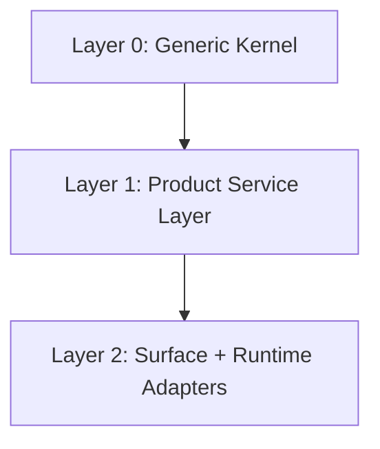

# Generic Kernel and Product Boundary

This document defines the boundary between:

- the **generic kernel**
- the **product/service layer**
- the **surface and runtime adapters**

The immediate target product is browser-first remote Codex, but the purpose of this document is to avoid baking Codex-specific product semantics directly into the kernel.

This document complements:

- [generic-kernel.md](generic-kernel.md)
- [browser-first-remote-codex.md](browser-first-remote-codex.md)
- [browser-first-remote-codex-execution-plan.md](browser-first-remote-codex-execution-plan.md)

## Why This Boundary Matters

Opscure is already converging on a generic core with:

- `Space`
- `Actor`
- `Event`
- cursor-based delta reads
- event streams and resume semantics

The browser-first remote Codex product adds real product needs on top:

- task ownership
- queue state
- approval state
- heartbeat freshness
- evidence-backed execution
- browser UX honesty

Those needs are real, but they should not all land in the kernel.

The correct split is:

- the kernel owns **generic state/event primitives**
- the product layer owns **remote Codex work semantics**
- the adapters own **browser, Discord, and runtime-specific behavior**

## Layer Model



### Layer 0: Generic Kernel

The generic kernel should contain only capabilities that can be reused across multiple behaviors or products.

### Layer 1: Product Service Layer

This layer contains domain-specific but cross-surface logic for one product.

For the current product, that means:

- remote Codex task model
- machine/thread bindings
- ownership and task policy
- approval and evidence interpretation

### Layer 2: Surface and Runtime Adapters

This layer translates product state into:

- browser UI
- Discord coordination
- local device runtime actions

## Decision Rule for Kernel Promotion

Something belongs in the generic kernel only if:

1. at least two behaviors or products need the same concept
2. the concept survives renaming without losing meaning
3. the concept does not depend on browser UX wording, Discord rules, or a specific runtime

If those conditions are not met, the concept stays outside the kernel.

## What the Kernel Should Own

## 1. Event Substrate

This is already the foundation and should remain in the kernel.

### Responsibility

- stateful spaces
- actors inside spaces
- immutable or append-only events
- event stream cursoring
- replay and resume
- subscription freshness

### Canonical Kernel Models

```text
Space
Actor
Event
EventEnvelope
EventCursor
SubscriptionPresence
```

### Kernel API Surface

Examples:

- `GET /api/spaces`
- `GET /api/actors`
- `GET /api/events/spaces/{space_id}?after_cursor=...`
- `GET /api/events/spaces/{space_id}/stream?...`

### Why It Is Generic

Every behavior and product needs:

- event history
- ordered replay
- live stream
- reconnect safety

This is generic by nature.

## 2. Presence and Lease Primitives

This is the strongest candidate for immediate kernel promotion.

### Responsibility

- actor presence in a scope
- claim/lease ownership of a resource
- heartbeat freshness
- lease expiration
- stale detection

### Kernel Models

```text
ActorSession
- session_id
- actor_id
- scope_kind
- scope_id
- status
- last_seen_at
- expires_at

ResourceLease
- lease_id
- resource_kind
- resource_id
- holder_actor_id
- lease_token
- claimed_at
- expires_at
- status
```

### Generic API Shape

Examples:

- `POST /api/leases`
- `POST /api/leases/{lease_id}/heartbeat`
- `POST /api/leases/{lease_id}/release`
- `GET /api/scopes/{scope_id}/presence`

### Why It Is Generic

The same pattern shows up in:

- chat participant ownership
- orchestration worker claim
- ops incident owner
- remote task owner

The product should not reimplement this forever if multiple behaviors need it.

Status:

- a minimal generic `ActorSession` / `ResourceLease` primitive is now present in the kernel
- the product-layer remote task service should reuse that primitive rather than promoting `RemoteTask` directly into the kernel
- orchestration worker/job lifecycle should also reuse the same primitive rather than growing a second ownership system

## 3. Generic Operation Primitive

This is the largest optional promotion target.

For now, the remote Codex product may still implement it as a product-level `RemoteTask`.
But structurally, a generic kernel-level `Operation` model makes sense.

Status:

- a thin schema-only `Operation` draft may live in the kernel as a future-compatible shape
- persistence, APIs, and product semantics should remain outside the kernel until at least two behaviors actually need them

### Responsibility

- a unit of work
- assignment to one actor
- lifecycle status
- progress heartbeat
- evidence

### Kernel Model Draft

```text
Operation
- operation_id
- space_id
- subject_kind
- subject_id
- kind
- objective
- requested_by
- status
- created_at
- updated_at

OperationAssignment
- operation_id
- actor_id
- lease_id
- status
- claimed_at
- released_at

OperationHeartbeat
- operation_id
- actor_id
- phase
- summary
- metrics_json
- created_at

OperationEvidence
- operation_id
- actor_id
- kind
- summary
- payload_json
- created_at
```

### Suggested Generic Status Set

```text
queued
claimed
executing
verifying
blocked
interrupted
completed
failed
stalled
```

### Why It Can Be Generic

This structure can represent:

- remote Codex browser work
- orchestration jobs
- verification jobs
- ops remediation steps

What makes it generic is not the current product name, but the ownership + progress + evidence lifecycle.

## 4. Generic Decision Primitive

Approval is a product need now, but structurally it is a special case of a generic decision gate.

### Responsibility

- a running operation needs a decision
- the bridge tracks requested, pending, and resolved state

### Kernel Model Draft

```text
DecisionRequest
- decision_id
- operation_id
- kind
- status
- reason
- note
- requested_by
- requested_at
- resolved_by
- resolution
- resolved_at
```

### Why It Is Generic

This covers:

- approval
- confirmation
- human gate
- policy gate

It is not remote-Codex-specific.

## 5. Evidence and Artifact References

Structured evidence belongs close to the operation model.

### Responsibility

- evidence summaries
- artifact references
- machine-readable counts and refs

### Kernel Model Draft

```text
ArtifactRef
- artifact_id
- operation_id
- kind
- label
- uri
- metadata_json

EvidenceMetric
- commands_run
- files_read
- files_modified
- tests_run
```

### Why It Is Generic

Verification, orchestration, and remote Codex work all need proof that work actually happened.

## What the Kernel Should Not Own

The following must remain outside the kernel.

## 1. Remote Codex Product Semantics

These are specific to the current product:

- machine picker semantics
- thread picker semantics
- transcript line window projection
- app-server turn id handling
- browser turn composer behavior
- reasoning effort display
- interrupt button copy
- "feels like local Codex" UX rules

These are product-layer responsibilities.

## 2. Browser UX Contracts

The kernel should never own:

- optimistic user bubbles
- queue card layout
- mobile layout decisions
- status copy such as `Queued`, `Blocked`, `Reconnecting`
- badge placement
- panel grouping rules

The browser can project kernel and product state, but the browser UX itself is not kernel state.

## 3. Discord Coordination Semantics

These do not belong in the kernel:

- mention rules
- `[TASK]`, `[INFO]`, `[END]`
- handoff wording
- anti-echo policies
- room etiquette
- mirror policies

These belong in coordination adapters or product-level coordination services.

## 4. Runtime Adapter Semantics

These are device/runtime-specific:

- Codex app-server binding
- local CLI spawn behavior
- Windows UTF-8 handling
- specific runtime command wrappers
- file read/write evidence detection rules tied to one runtime

These stay in adapter code.

## Product Service Layer for Browser-First Remote Codex

This layer is where the immediate implementation should continue.

## Product Object: RemoteTask

Until a generic kernel `Operation` is promoted, the product should use `RemoteTask`.

### RemoteTask Model

```text
RemoteTask
- task_id
- machine_id
- thread_id
- origin_surface
- origin_message_id
- objective
- success_criteria_json
- status
- priority
- owner_actor_id
- created_by
- created_at
- updated_at
```

### RemoteTask Assignment

```text
RemoteTaskAssignment
- assignment_id
- task_id
- actor_id
- lease_token
- lease_expires_at
- status
- claimed_at
- released_at
```

### RemoteTask Heartbeat

```text
RemoteTaskHeartbeat
- heartbeat_id
- task_id
- actor_id
- phase
- summary
- commands_run_count
- files_read_count
- files_modified_count
- tests_run_count
- created_at
```

### RemoteTask Evidence

```text
RemoteTaskEvidence
- evidence_id
- task_id
- actor_id
- kind
- summary
- payload_json
- created_at
```

### RemoteTask Approval

```text
RemoteTaskApproval
- approval_id
- task_id
- actor_id
- reason
- status
- note
- requested_at
- resolved_at
- resolved_by
- resolution
```

### RemoteTask Note

```text
RemoteTaskNote
- note_id
- task_id
- actor_id
- kind
- content
- created_at
```

## Product Service Responsibilities

The browser-first remote Codex service should own:

- browser submit -> task creation
- task -> runtime command mapping
- evidence requirements before `executing`
- approval interpretation
- stalled detection policy
- canonical machine/thread binding
- transcript freshness projection rules

### Product Rules

Examples of product-level rules that should not be in the kernel:

- `executing` requires evidence
- browser submit creates both optimistic local UI and canonical remote task
- one active task owner per thread by default
- approval state blocks further browser submit on the same thread
- transcript freshness and task progress are projected separately

## Browser Contract

The browser should speak only to the product service layer, not directly to coordination text.

### Browser Read Model

For one selected machine + thread, the browser needs:

```text
ThreadProjection
- machine
- thread
- transcript
- sync_state
- queue_state
- active_tasks
- latest_approval
- reconnect_state
```

### Browser Submit Contract

```text
POST /api/remote/tasks
{
  "machine_id": "...",
  "thread_id": "...",
  "origin_surface": "browser",
  "objective": "...",
  "success_criteria": {...},
  "created_by": "browser-user"
}
```

### Browser Task Rendering Requirements

The browser should render task state with enough separation that the user can tell:

- submitted but not yet claimed
- claimed but not yet really executing
- executing with evidence
- blocked on approval
- interrupted
- completed
- failed
- stalled

### Browser Stream Contract

The browser should consume typed updates such as:

```text
task.created
task.claimed
task.heartbeat
task.evidence.added
task.blocked_approval
task.completed
task.failed
task.interrupted
task.stalled
transcript.delta
transcript.reset
```

The browser must not infer task truth from Discord messages.

## Agent Contract

The agent should also speak to the product layer, not directly to coordination text.

### Agent Work Loop

```text
1. list or subscribe to tasks for a machine
2. claim one task
3. heartbeat claimed
4. begin real work
5. emit evidence
6. heartbeat executing/verifying
7. complete, fail, interrupt, or request approval
```

### Agent API Contract

```text
POST /api/remote/tasks/{task_id}/claim
POST /api/remote/tasks/{task_id}/heartbeat
POST /api/remote/tasks/{task_id}/evidence
POST /api/remote/tasks/{task_id}/approval
POST /api/remote/tasks/{task_id}/complete
POST /api/remote/tasks/{task_id}/fail
POST /api/remote/tasks/{task_id}/interrupt
```

### Required Agent Evidence Kinds

At minimum:

- `command_execution`
- `runtime_turn_started`
- `runtime_turn_completed`
- `file_read`
- `file_write`
- `test_result`
- `approval_requested`
- `error`

### Agent Guardrails

An agent must not advertise `executing` if:

- no commands were run
- no files were read
- no files were modified
- no tests were run
- no runtime turn signal exists

If the agent sends a heartbeat that implies work without evidence, the product service should normalize the task back to `claimed`.

## Discord Contract

Discord should talk to the product service only through typed coordination notes or explicit task creation.

### Discord Allowed Writes

Examples:

- create task explicitly
- add note to task
- ask question on task
- handoff task

### Discord Forbidden Writes

Examples:

- plain AI message implicitly creating a task
- progress chatter updating canonical task state directly
- free-form human text automatically rewriting task state without parsing rules

### Discord Read Model

Discord should mostly mirror:

- task progress
- task result
- task approval needed
- coordination notes

It should not become the canonical execution transcript source.

## Recommended Promotion Path

This is the safest evolution path.

### Now

Keep these in the product layer:

- `RemoteTask`
- approval logic
- browser task panel
- agent heartbeat/evidence policy
- Discord mirror rules

### Promote Next

Promote to kernel only after reuse is proven:

- lease/presence primitives
- generic operation model
- generic decision model
- evidence/artifact references

### Keep Out of Kernel Long-Term

Even long-term, keep these out:

- Codex-specific runtime behavior
- browser UX copy and layout
- Discord protocol tags
- device-specific runtime adapters

## Implementation Guidance

For the current codebase, the recommended implementation order is:

1. continue shipping `RemoteTask` in the product layer
2. wire browser and agent around `RemoteTask`
3. observe which parts start repeating across behaviors
4. then promote only those repeated parts into generic kernel primitives

This avoids freezing the wrong abstractions too early.

## Summary

The correct boundary is:

### Kernel

- event substrate
- stream/replay/resume
- presence/lease
- optional future operation/decision/evidence primitives

### Product Service

- remote Codex tasks
- ownership policy
- approval policy
- task heartbeat semantics
- evidence-backed execution policy
- machine/thread bindings

### Adapters

- browser rendering
- Discord coordination
- local runtime integration

That is the split that keeps the kernel reusable while still letting the browser-first remote Codex product move quickly.
